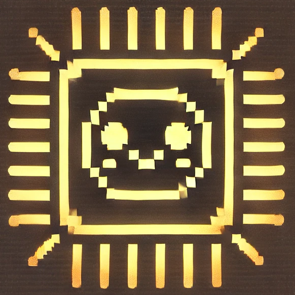

# Py8

Py8 is a CHIP8 emulator writen in C/Python. Py8 aims to ship an easy to use emulator with a comprehensive GUI.

## License
Py8 is licensed under the [GNU Public License](https://www.gnu.org/licenses/gpl-3.0.en.html).

## Installation

### Linux

### Windows

### Mac

```bash
pip install -r requirements.txt
python setup.py install
```
## Usage

### Keys

The COSMAC-VIP had a hexadecimal keypad


| `1` | `2` | `3` | `C` |
|-----|-----|-----|-----|
| `4` | `5` | `6` | `D` |
| `7` | `8` | `9` | `E` |
| `A` | `0` | `B` | `F` |

Our emulator maps this keypad to a the modern computer keyboard as follows:

| `1` | `2` | `3` | `4` |
|-----|-----|-----|-----|
| `Q` | `W` | `E` | `R` |
| `A` | `S` | `D` | `F` |
| `Z` | `X` | `C` | `V` |


## ROMs
We do not include any ROM file here, but you can encounter CHIP8 ROMs all over internet. We list some repositiories:

- [https://github.com/jamesmcm/chip8go](https://github.com/jamesmcm/chip8go)
- [https://johnearnest.github.io/chip8Archive/](https://johnearnest.github.io/chip8Archive/)
- [https://chip-8.github.io/links/](https://chip-8.github.io/links/)

### Tested ROMs

## TO-DOs
